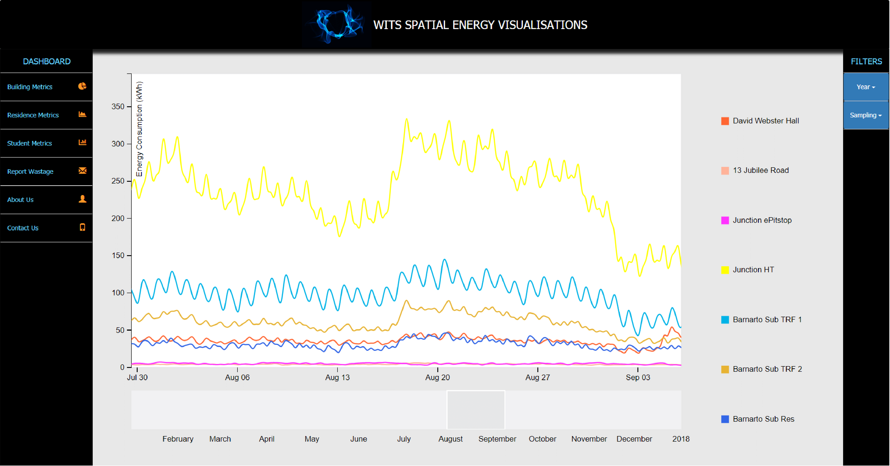
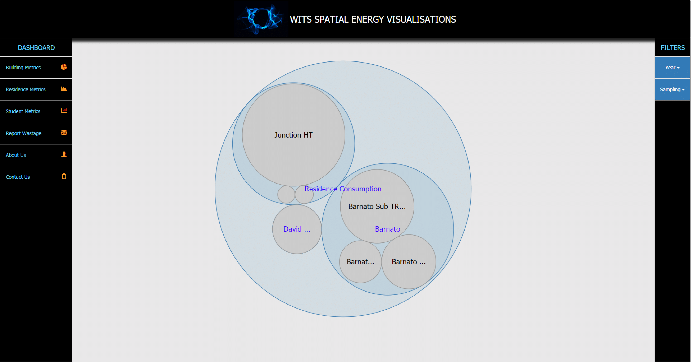
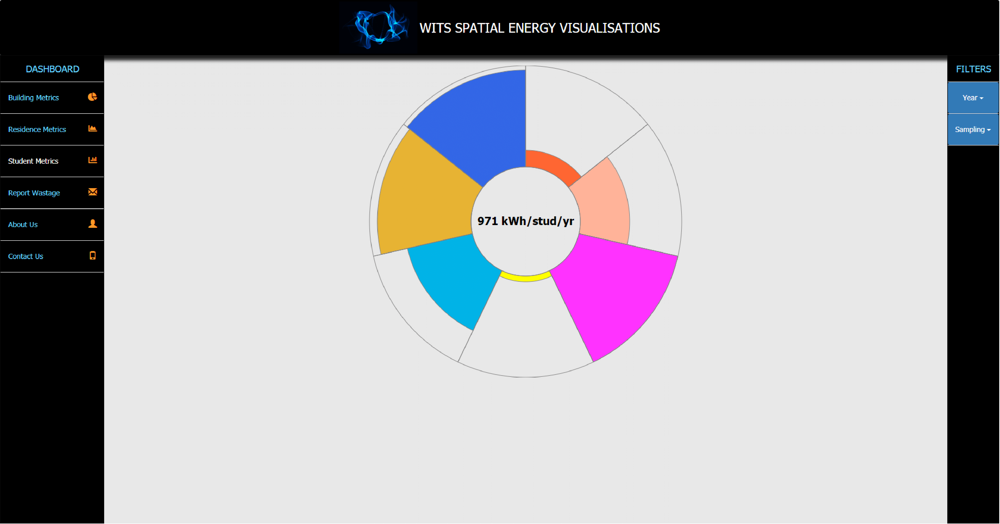

# Spatial-Energy-Wits

This repository contains the code-base for an MVP, **Wits Spatial Energy Visualisations**, which has a client-side application hosted as an Azure App service and Database Servers hosted on Google Cloud Platform VMs. The website can be accessed at [https://spatialwits.azurewebsites.net](https://spatialwits.azurewebsites.net).

## Running client-side application

**Note:** The database servers have blocked ingress traffic on unknown traffic, thus running the client-side application locally will fail to retireve stored consumption data - use the website above if you wish to test that component.

First install required project packages:

`npm install`

Then run the server locally:

`npm start`

Process to view the application at [http://localhost:3000/](http://localhost:3000/)

Tests can be run using:

`npm test`

## Visualisation Demo
**Note:** A demo of the functional application can be found at `Docs/Site_Demo_and_Mockups/site demo video.mp4`

